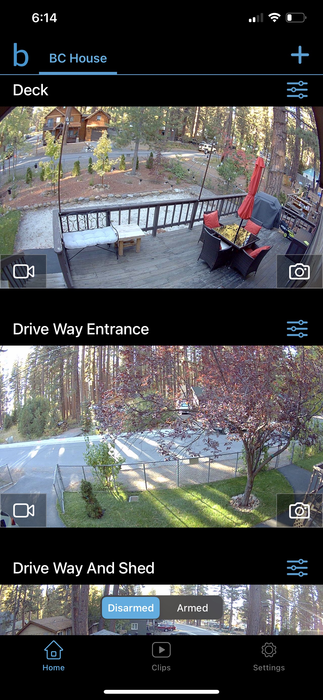
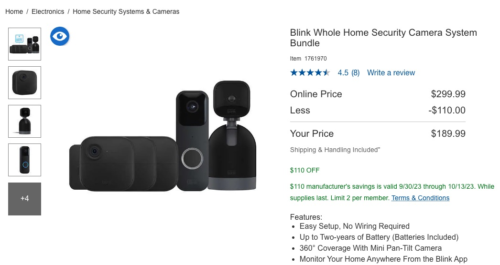

# First Journal Entry...

# House Secutity Cameras

Gustavo Bravo Corona. 
Oct 6, 2023

I live in Lake Tahoe a nice and calm place where we only worry about the bears breaking in to the trash and making a mess. One day my dad noticed that his bike was missing and was then worried tha who ever took the bike was going to come back and try to steal something else from out side or the shed. He instantly called me and told me that we then needed to get some security cameras that will help us monitor all areas outside of our house I then saw that there was an amazing deal at Costco 3 (3 Outside Camers, 1 Ring Camera, 1 indoor camera) I thought it was a good deal for a pack of cameras and since we needed something available ASAP those were great. Reading the box instrutions and information of what is needed to be able to set them up it seemed like a **SALIENT** product it really jumped out to me since it seemed simple to set up and no cables were needed only batteries. 

Once Opening the box I was expecting it to be easy setting the cameras up and just downloading the app and being able to see the cameras like it said in the box. I was really expecking a simple application where i was able to monitor the cameras at all time. I also expected the app on the phone to be easy to understand and easy to learn when I firts opened the app. I was also expexting a free no subscription application since the cameras are mostly used for the saftey of the users and to monitor the users property. The **FEEDBACK** and **AFFORDANCE** of the application was poor it was hard to understand and nothing was visible i wasnt sure what I was able to do in the application where the settings were and it had no description of the available interactions in the app. 

At the end the outcome was not what I expected the process wasn't hard understand, I was able to sync the cameras to the Sync Module that will store the recorded videos. I was not aware that I was going to need to but a usb flashdrive to be able to save the videos so I had to but it seperatly. Something that really made me unhappy was the **HEURISTIC** design of the application the user control and user fredom was horrible I was not informed that I was going to need to subscribe to a monthly payment plan where I would be able to have more user control over the cameras and be able to use the different security modes or just costumise the settings to my likings. Its really taking away alot of the important and more useful tools of the cameras that really makes the users/buyers regret their purchase. Paying to be able to mute the notifications and being able to create personal settings is really the down side of the cameras it should be free for the user to be able to personalize the type of security and the cameras to a specific liking when in the end most of the users but the cameras for security. 
