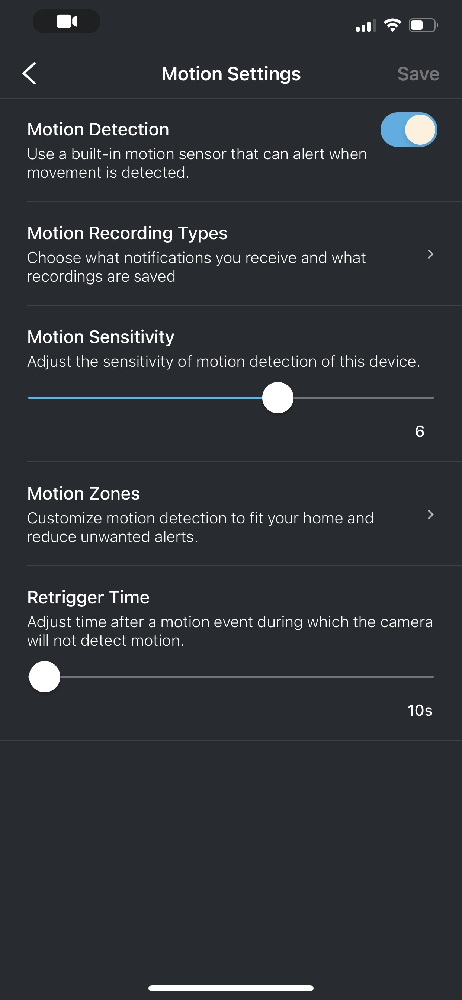

# First Journal Entry...

# Blink House Security Cameras

Gustavo Bravo Corona. 
Nov 30, 2023

I live in Lake Tahoe and with all my life living there, it's a calm and beautiful place to live. During my time living there, I have never seen any crime around my home area. The people in Tahoe mostly worry about the bears breaking into the cars and houses to get food. Unfortunately one day my dad noticed that his bike was missing. He was then worried that whoever took the bike was going to come back and try to take something else. He instantly called me and told me that we needed to get some cameras that would help us monitor all areas outside of our house and prevent something like that from happening again. I then saw that there was an amazing deal at Costco where they were selling some Blink Cameras for only $189 the deal included (3 Outside Cameras, 1 Ring Camera, and 1 indoor camera) I thought it was a good deal for a pack of cameras and since we needed something available as soon as possible. Reading the box instructions and information of what is needed to be able to set them up it seemed like a **SALIENT** product. The setup process for the cameras was intuitive, no cables were required, and they were easy to install with just batteries. The design is accessible and effortless, making monitoring our surroundings a streamlined and engaging experience.

Once I opened the box I was expecting an easy process of getting the cameras set up and simply downloading the app to be able to monitor the cameras like it said in the box. For the app, I was also expecting it to be an easy application to work with where I would be able to monitor the cameras at all times. I believed that it was going to be easy to understand and easy to learn when I first opened the app. Since they're cameras I was also expecting a free application with no need to pay for any Subscriptions, most cameras are used for the security of the users and to monitor the user's property at all times. The app lacked effective **FEEDBACK**, leaving me unsure of whether my actions were registering with the cameras. Additionally, the app's poor **AFFORDANCE** made it difficult to understand its functionalities and available interactions, with no clear guidance on where to find settings or navigate through the options.

Before setting up the cameras I needed to scan a QR code in the back of the cameras when removing the cover. In the app, it had an image showing me where I could find it and how it looked. When scanning the QR code the cameras would sync to the module where all the clips and images are stored. I had some trouble with one of the cameras not wanting to connect to the module so I had to keep exiting the app and opening it back up. Once I was able to connect all of the cameras I was then able to install them outside around my house. Being able to monitor the cameras was simple and easy once opening the app you're able to see all of the cameras you have connected and can view them by just pressing the play button. The Sync module is only able to store a certain amount of videos and if the memory of the module gets full the videos won't be saved and you wouldn't be able to see the recordings when buying the cameras I was not aware that I was going to need to buy a USB flash drive to be able to have more memory and make sure that any recording or alert is saved.

The user control and user freedom of the application were horrible. When I was trying to set the cameras to a specific setting I saw that I was given a free 3-month subscription plan I started looking more at what the plan included and at first, I wasn't expecting to need to pay for a monthly subscription plan to be able to customize and open up more available settings for the camera. If I don't pay for the subscriptions I wouldn't be able to customize the different motion alerts whether I want the cameras to notify me of any type of movement in certain areas of the camera's zones or only alert me when a person is detected in the area. More available settings with the monthly subscription include being able to select the length of the video the cameras would capture and save in the Sync Module and the most annoying setting would be being able to mute the alerts and notifications sent to my phone. It's taking away a lot of the important and more useful tools of the cameras that make the users/buyers regret their purchase. The **HEURISTIC** evaluation of the application's design highlighted significant flaws in user control and freedom. The lack of upfront information about the necessary subscription for essential features heavily impacted the usability and overall satisfaction, taking away important functionalities that users expect to customize for their security needs. All of the different settings should be free for the user to be able to personalize the type of security and the cameras to a specific liking when in the end most of the users buy the cameras for security and not to be messing around in the setting trying to figure out which ones are available for free and which ones aren't.
